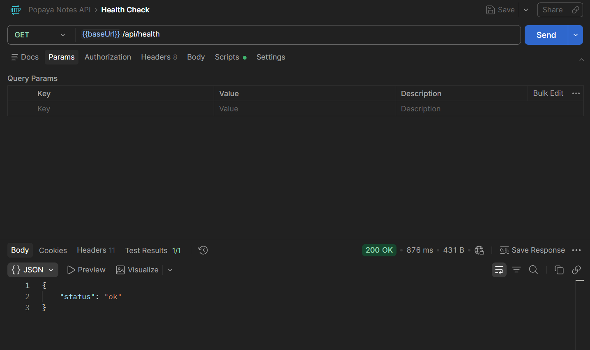
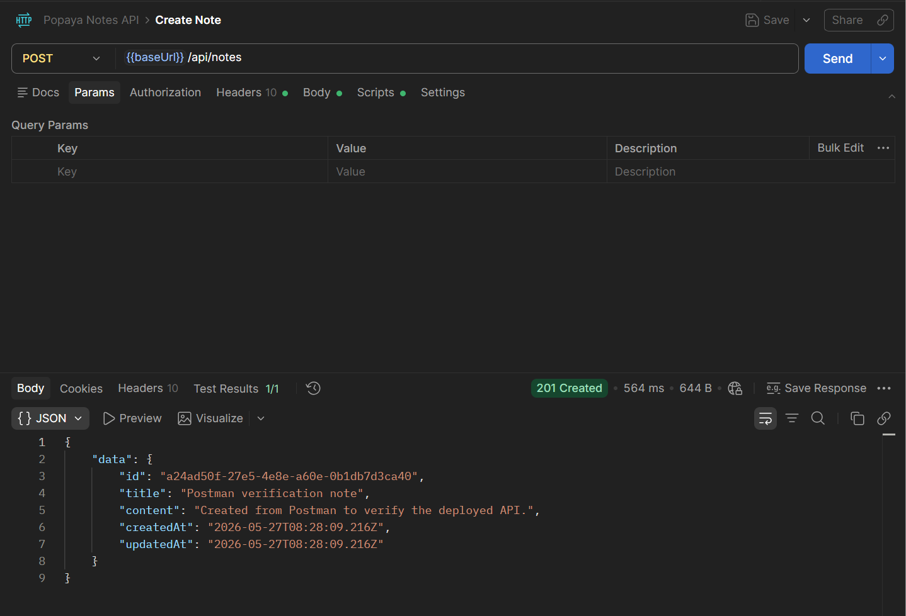
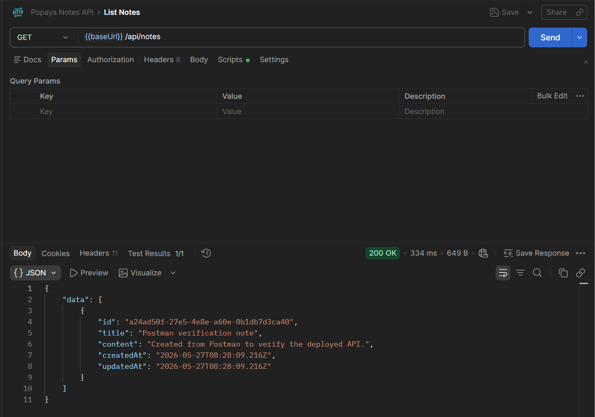
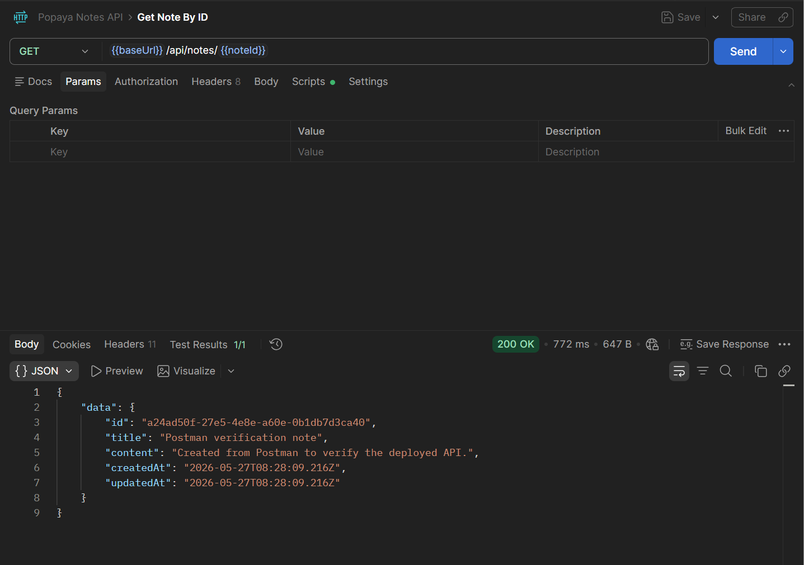
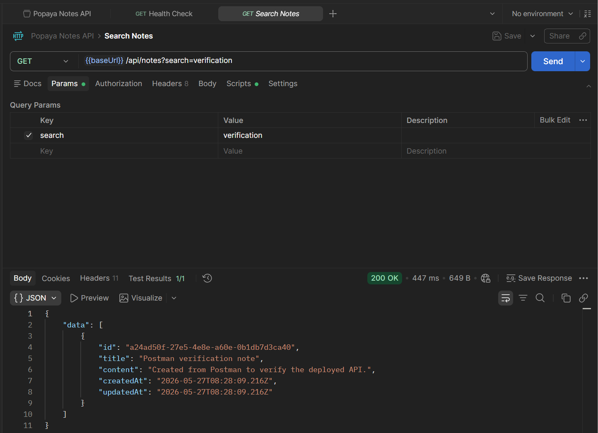
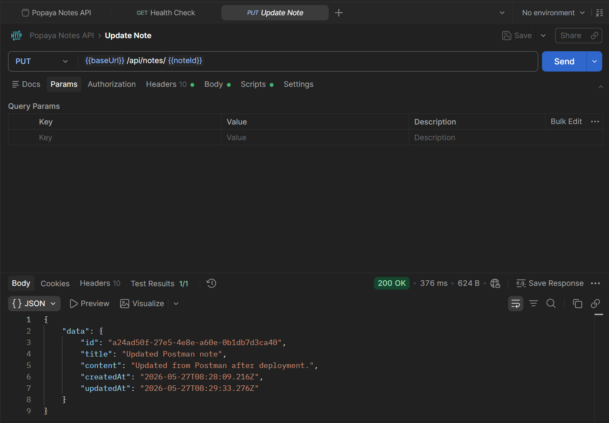
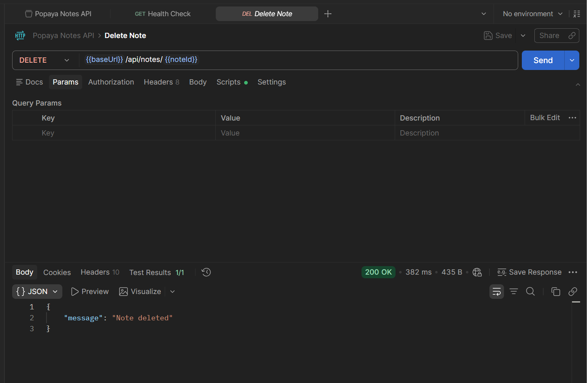
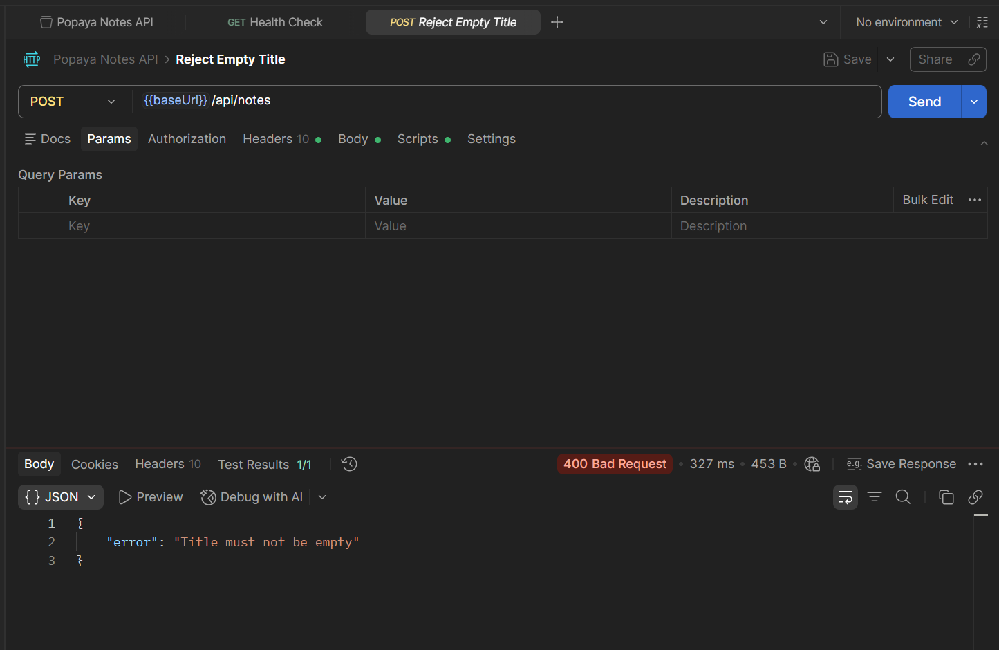

## **Popaya Technical Assessment Report** 

## **Core Bug Fixes** 

- Fixed undefined variables such as userList and username. 

- Converted route id parameters to numbers before comparing them with stored numeric ids. 

- Made getUserById return the found user instead of silently doing nothing. 

- Fixed notes.length spelling and other runtime errors. 

- Replaced accidental assignments in conditions and filters with comparisons. 

- Generated note ids when a note is created instead of storing the function itself. 

- Added validation and proper 400, 401, 404, and 500 responses. 

- Prevented deleting from index -1 when a note does not exist. 

- Fixed login logic so both email and password must match. 

- Fixed profile and sum routes to return correct values. 

- Made the server port and console message consistent. 

## **Backend Changes** 

- Added an Express Notes API in backend/notes-api/src/server.js. 

- Added a file-backed NotesStore in backend/notes-api/src/store.js. 

- Stored notes in backend/notes-api/data/notes.json so data persists after refresh or restart. 

- Implemented POST, GET, GET by id, PUT, DELETE, and search endpoints. 

- Supported both /api/notes and /notes route prefixes. 

- Added validation so empty titles are rejected with a clear error message. 

- Sorted notes by most recently updated. 

## **Frontend Changes** 

- Built the UI with HTML, CSS, and vanilla JavaScript. 

- Added a notes list, search input, editor form, save button, clear button, and delete buttons. 

- Connected the UI to the backend using fetch requests. 

- Added loading, empty, validation, and error states. 

- Added responsive CSS so the app works on desktop and mobile screen sizes. 

- Used confirmation before deleting notes. 

## **How the App Works** 

- **1** The user enters a note title and content in the frontend form. 

- **2** JavaScript sends the data to the backend API with fetch(). 

- **3** The backend validates the title and saves the note in notes.json. 

- **4** The frontend reloads the list and shows the latest saved notes. 

- **5** Search sends a query to the backend, which checks both title and content. 

## **Verification** 

API verification was completed using Postman after deploying the project on Vercel. 

Verified endpoints: 

## **- GET /api/health - confirmed backend is running** 

## **- POST /api/notes - created a new note** 

## **- GET /api/notes - fetched all notes** 

## **- GET /api/notes/:id - fetched a single note** 

## **- GET /api/notes?search=query - searched notes by title/content** 

## **- PUT /api/notes/:id - updated an existing note** 

## **- DELETE /api/notes/:id - deleted a note** 

## **- Validation checked for empty title input** 

## Deployment URL: 

https://popaya-tech-assignment.vercel.app 

Postman was used to confirm successful responses, status codes, and JSON response structure. 

